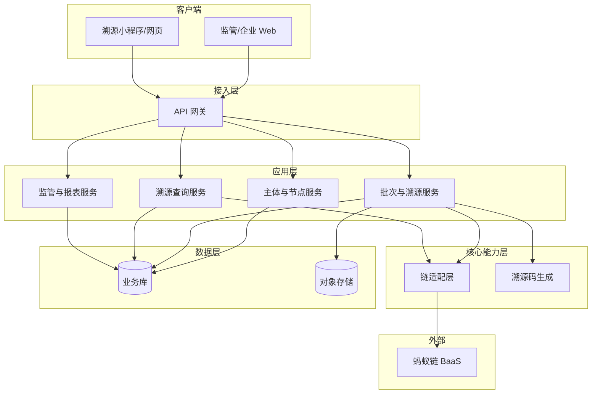

# 千岛湖渔业溯源平台 · 技术方案

> 依据《技术架构原则》：简单优于复杂、边界清晰、可观测、可演进、安全与合规。  
> 对应 PRD：[QIANDAO_LAKE_FISHERY_TRACEABILITY_PRD.md](./QIANDAO_LAKE_FISHERY_TRACEABILITY_PRD.md)

---

## 一、背景与目标

### 1.1 业务背景

- 千岛湖渔业需「养殖/捕捞 → 加工 → 流通 → 消费」全链路可追溯、可验真、不可篡改。
- 客户明确要求基于**蚂蚁链**做链上存证与溯源核验，政府与多方共治。
- 需支持政府监管（大屏、报表、抽检审计）、各环节主体登记上链、消费者扫码溯源。

### 1.2 技术目标

| 目标         | 说明 |
|--------------|------|
| 全链路可追溯 | 各环节关键数据上链，消费者/监管方可查询与链上核验 |
| 边界清晰     | 业务域与链对接解耦，存证/核验抽象为统一接口，便于替换或扩展 |
| 可观测       | 上链、核验、关键业务操作有日志与指标，便于排障与容量规划 |
| 可演进       | 链配置与多链扩展预留；主体类型与环节可配置扩展 |

### 1.3 约束（来自 PRD 非功能需求）

| 类型     | 约束 |
|----------|------|
| **性能** | 溯源查询响应 ≤ 3s（含链上核验）；批量上链队列 + 重试，不阻塞业务提交 |
| **可用性** | 业务系统可用性 ≥ 99%；链核验失败时降级为「暂不展示链上核验」，不影响溯源链展示 |
| **安全** | HTTPS、敏感数据加密存储、接口鉴权、密钥与链配置安全管理 |
| **合规** | 个人信息与主体信息脱敏与留存符合监管要求；操作与上链日志可审计 |

---

## 二、总体架构

### 2.1 架构图（逻辑视图）

### 2.2 模块职责与边界

| 模块           | 职责 | 依赖方向 | 说明 |
|----------------|------|----------|------|
| **主体与节点服务** | 主体注册/审核、与链身份映射、权限与角色 | → 业务库 | 不直接调链，仅维护主体与链身份配置 |
| **批次与溯源服务** | 养殖/捕捞、加工、检测、流通/销售、溯源码绑定；编排上链与重试 | → 链适配层、业务库、对象存储 | 唯一写「业务数据 + 触发存证」的域服务 |
| **溯源查询服务** | C 端扫码/溯源码查询、溯源链展示、链上核验结果展示 | → 业务库、链适配层 | 只读 + 核验，可降级 |
| **监管与报表服务** | 大屏、批次/流向报表、抽检与审计、操作/上链日志查询 | → 业务库 | 只读与任务下发，不直接写链 |
| **链适配层**     | 存证/核验抽象，对接蚂蚁链 BaaS；重试、超时、降级 | → 蚂蚁链 | 与具体链解耦，便于多链或替换 |

依赖规则：应用层 → 核心能力层/数据层；**链适配层** 仅被「批次与溯源」「溯源查询」调用，无反向依赖，无循环。

---

## 三、核心模块说明

### 3.1 链适配层（Chain Adapter）

- **职责**：封装「存证」「核验」两种能力，对上游只暴露稳定接口；内部对接蚂蚁链 BaaS 对应 API。
- **接口（建议）**：
  - `submitEvidence(payload: EvidencePayload): Promise<EvidenceReceipt>`  
    入参：业务类型、主体标识、数据摘要/哈希等；出参：交易哈希或存证凭证。
  - `verifyEvidence(receipt: EvidenceReceipt): Promise<VerifyResult>`  
    入参：存证凭证；出参：是否通过、存证时间、失败原因等。
- **策略**：
  - 超时（如 2s）未返回则视为失败，由调用方决定重试或降级。
  - 核验失败/超时时，返回明确错误码，溯源侧展示「链上核验暂不可用」而非伪造通过。
- **可演进**：通过「链配置」区分环境/租户/多链，EvidencePayload 与链无关，便于后续多链或链迁移。

### 3.2 批次与溯源服务（Batch & Trace Code）

- **职责**：承接养殖/捕捞、加工、检测、流通、销售各环节的登记与溯源码绑定；生成批次号、溯源码；调用链适配层上链，落库存证凭证。
- **上链策略**：
  - 登记「提交并上链」：先落库为「待上链」，异步或同步调用链适配层；成功则更新存证凭证与状态为「已上链」，失败进入重试队列。
  - 重试：基于队列（如 DB 表 + 定时任务或消息队列）重试，避免阻塞提交；可配置最大重试次数与告警。
- **溯源码**：全局唯一（如雪花或业务规则）；与批次/子批次绑定关系上链存证；支持一物一码/一批一码。
- **检测报告**：文件存对象存储，报告哈希（及可选摘要）上链；原文访问受权限控制。

### 3.3 溯源查询服务

- **职责**：根据溯源码反查批次，递归组装「养殖 → 加工 → 检测 → 流通 → 销售」溯源链；拉取链上核验结果并展示。
- **性能**：溯源链与节点信息读业务库（可缓存热点）；核验调用链适配层，设超时与降级，保证整体 ≤ 3s。
- **降级**：链核验超时或失败时，仅隐藏「链上核验通过」标识，仍展示溯源链与业务侧已存证信息，并提示「链上核验暂不可用」。

### 3.4 主体与节点服务

- **职责**：主体 CRUD、审核、与蚂蚁链身份/账户的映射配置；权限与角色、数据范围（按区域/主体）。
- **与链关系**：不在该服务内直接调链；链上身份由平台或政府在蚂蚁链控制台配置，业务侧只传「主体标识」，由批次服务在存证时带入。

### 3.5 监管与报表服务

- **职责**：监管大屏（指标与预警）、批次/流向多维报表、抽检任务与结果、操作日志与上链日志查询与导出。
- **数据来源**：全部来自业务库与日志表，不直接访问链；链上审计依赖「上链日志」中的存证凭证与结果。

---

## 四、接口与数据流

### 4.1 存证数据流（简化）

1. 用户在「批次与溯源服务」完成登记（如捕捞批次、加工批次、检测报告、销售绑定溯源码等）。
2. 服务生成批次号/溯源码，写入业务库，状态「待上链」。
3. 调用链适配层 `submitEvidence`，传入业务类型 + 主体 + 数据摘要/哈希。
4. 链适配层调用蚂蚁链 BaaS，获得交易哈希/凭证；回写业务库并更新为「已上链」，记录上链日志。
5. 若链调用失败，写入重试队列并记录上链日志（失败），由后台重试。

### 4.2 核验数据流（C 端溯源）

1. 用户扫码或输入溯源码，请求溯源查询服务。
2. 根据溯源码查业务库得到绑定批次及完整溯源链节点。
3. 对需要展示「链上核验」的节点，用已存证凭证调用链适配层 `verifyEvidence`。
4. 汇总核验结果与溯源链，返回前端；超时或失败则对应节点不展示「已核验」，并做统一提示。

### 4.3 接口版本策略

- 对外 API 建议带版本前缀（如 `/api/v1/...`），新增能力尽量新接口或新字段，避免破坏现有客户端。
- 链适配层内部接口保持稳定；蚂蚁链 API 升级时在适配层内兼容，必要时做适配与配置切换。

---

## 五、技术选型与理由

| 选型项       | 建议 | 理由 | 替代/对比 |
|--------------|------|------|-----------|
| **区块链**   | 蚂蚁链 BaaS | 客户明确要求；具备存证与核验能力 | 不替代，仅通过链适配层抽象接口，便于未来多链或迁移 |
| **后端形态** | 单体 + 模块化 或 少量微服务 | 首版团队与规模可控时，简单优于复杂；模块边界清晰即可 | 若团队与流量大，再拆成「批次」「溯源」「监管」等微服务 |
| **数据库**   | 关系型（如 MySQL/PostgreSQL） | 主体、批次、关联、报表查询以关系型为主；事务与一致性需求明确 | 文档型仅作补充（如大屏配置）时可考虑 |
| **文件存储** | 对象存储（如 OSS/S3） | 检测报告等文件；与业务库解耦，便于容量与访问控制 | 本地/NAS 不利于扩展与高可用 |
| **上链重试** | DB 表 + 定时任务 或 轻量 MQ | 简单可靠，满足「不阻塞提交 + 重试」；MQ 可后续引入 | 首版可不用 Kafka/RocketMQ，减少运维成本 |
| **缓存**     | 可选 Redis | 溯源查询热点（如高频溯源码）可缓存溯源链摘要，降低 DB 与核验压力 | 首版若 QPS 不高可先不加 |

---

## 六、可观测性

| 项     | 做法 |
|--------|------|
| **日志** | 关键操作（登记、上链、核验、溯源码查询）打结构化日志；上链请求/响应与交易哈希写入上链日志表，便于对账与排查 |
| **指标** | 上链成功率、上链延迟、核验成功率、核验延迟、溯源查询 QPS 与 P99；按业务类型与主体可选维度 |
| **告警** | 上链失败率或积压超过阈值、核验超时率过高、接口错误率/延迟异常 |
| **追踪** | 关键请求带 traceId，从 API 到链适配层贯通，便于定位链侧或业务侧问题 |

---

## 七、安全与合规

- **传输**：全站 HTTPS；API 与前端分离时注意 CORS 与敏感头。
- **鉴权**：监管/企业端统一登录与鉴权（如 JWT 或 Session）；接口按角色与数据范围做权限校验。
- **敏感数据**：个人与主体敏感字段加密或脱敏存储；日志与导出中不包含明文敏感信息。
- **密钥与链配置**：链 ID、API Key 等放配置中心或环境变量，不落库不提交代码；访问控制与审计。
- **合规**：操作日志与上链日志保留期可配置，满足监管与审计要求。

---

## 八、风险与回滚

| 风险           | 应对 | 回滚/降级 |
|----------------|------|-----------|
| 蚂蚁链不可用或长时间抖动 | 上链异步 + 重试队列；核验超时降级 | 核验侧：不展示「链上核验通过」，仅提示暂不可用；上链侧：保持「待上链」持续重试，不丢单 |
| 上链成功率低或延迟大   | 监控与告警；与蚂蚁链侧对齐限流与容量 | 临时关闭非关键上链或降频，保证核心环节（如捕捞、销售绑定）优先 |
| 数据模型或接口变更    | 版本化 API；链上只存摘要/哈希，业务明细在业务库 | 通过版本与兼容字段回滚应用，链上历史数据仍可核验 |
| 存储或 DB 故障       | 主从/多副本；定期备份 | 从备份恢复；溯源查询可读从库或缓存，写操作降级维护 |

---

## 九、评审检查清单（架构原则）

- [x] 背景与约束（性能、可用性、合规）是否写清？
- [x] 核心组件/服务职责与边界是否明确？
- [x] 依赖关系与调用链是否清晰、无循环？
- [x] 技术选型理由是否充分？是否有替代方案对比？
- [x] 接口/契约是否稳定、版本策略是否明确？
- [x] 可观测性（日志、监控、告警）是否覆盖关键路径？
- [x] 风险与回滚策略是否提及？

---

## 十、建议实施顺序

1. **链适配层 + 主体与节点**：完成蚂蚁链 BaaS 对接（存证/核验）、主体管理与链身份配置。
2. **养殖/捕捞 + 批次与溯源码**：捕捞登记、批次号生成、上链与重试、溯源码生成与绑定（先一批一码）。
3. **加工与检测**：加工批次关联上游、检测报告上传与哈希上链。
4. **流通与销售**：入库/出库、销售与溯源码绑定、一物一码可选。
5. **溯源查询（C 端）**：溯源码查询、溯源链展示、链上核验与降级。
6. **监管与报表**：批次/流向报表、操作与上链日志；大屏与抽检（P1）可后续迭代。

---

**文档版本**：v0.1  
**依据**：技术架构原则 + 千岛湖渔业溯源 PRD  
**下一步**：与客户及蚂蚁链侧对齐联盟/节点与接口细节后，可细化 ADR 与接口契约（如 OpenAPI）。
