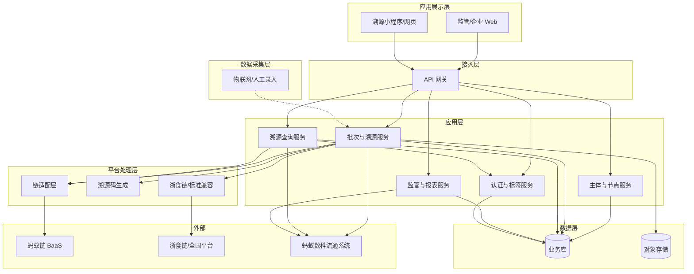

# 千岛湖全鱼品溯源平台 · 技术方案

> 依据《技术架构原则》：简单优于复杂、边界清晰、可观测、可演进、安全与合规。  
> 对应 PRD：[QIANDAO_LAKE_FISHERY_TRACEABILITY_PRD.md](./QIANDAO_LAKE_FISHERY_TRACEABILITY_PRD.md)（**v0.4**）。  
> **范围边界**：**流通环节（储运、入库/出库、配送等）由蚂蚁数科团队已建成**；本技术方案仅覆盖流通前环节（种源/投放、养殖/捕捞、加工、检测）及**与蚂蚁数科流通系统的对接**、溯源码与销售绑定（责任边界见 PRD 4.E）、溯源查询与监管。  
> **v0.4 对齐**：PRD v0.4 补充**上下游数量约束与校验**（养殖批次剩余可用数量、加工消耗累计、换算规则）；本方案在批次与溯源服务、数据模型与接口中同步体现。

---

## 一、背景与目标

### 1.1 业务背景

- **客户与项目**：商达公用集团（千岛湖智慧鱼谷）需「从水体到餐桌」全鱼品溯源，覆盖**两类养殖模式**——保水渔业（千岛湖天然有机）与 RAS 工厂化循环水（引水渔业）；种源/投放、养殖/生长、加工、检测由本平台登记并上链；**流通环节由蚂蚁数科已建成**，本平台通过对接获取流通数据并展示。
- **技术选型**：客户明确要求基于**蚂蚁链**做链上存证与溯源核验；数据标准与**浙食链**及未来全国平台兼容。
- **能力范围**：政府监管（大屏、报表、抽检审计）；本平台环节主体登记上链；**与蚂蚁数科流通系统对接**（获取储运、入库/出库、流向等）；溯源码与销售绑定（责任边界以约定为准）；认证与标签（有机、地理标志、GAP 等）；消费者扫码「鱼的一生」与链上核验；标准体系与三阶段实施路线。

### 1.2 技术目标

| 目标         | 说明 |
|--------------|------|
| 全链路可追溯 | 种源/投放（P1）、养殖/捕捞（双模式）、加工、检测由本平台登记并上链；**流通环节**数据通过对接蚂蚁数科流通系统获取并展示；消费者/监管方可查询完整溯源链（含流通节点）与链上核验；单尾追溯与批次追溯并行 |
| 边界清晰     | 业务域与链对接解耦，存证/核验抽象为统一接口；双模式（保水/RAS）与加工双路径在数据模型与接口上边界清晰 |
| 可观测       | 上链、核验、关键业务操作有日志与指标，便于排障与容量规划 |
| 可演进       | 链配置与多链扩展预留；主体类型与环节可配置扩展；浙食链/全国平台数据标准兼容预留 |

### 1.3 约束（来自 PRD 非功能需求）

| 类型     | 约束 |
|----------|------|
| **性能** | 溯源查询响应 ≤ 3s（含链上核验）；批量上链队列 + 重试，不阻塞业务提交 |
| **可用性** | 业务系统可用性 ≥ 99%；链核验失败时降级为「暂不展示链上核验」，不影响溯源链展示 |
| **安全** | HTTPS、敏感数据加密存储、接口鉴权、密钥与链配置安全管理 |
| **合规** | 个人信息与主体信息脱敏与留存符合监管要求；操作与上链日志可审计 |

---

## 二、总体架构

### 2.1 架构图（逻辑视图，三层一体化）

总体采用「数据采集层 + 平台处理层 + 应用展示层」一体化设计，与 PRD 需求文档一致。

- **数据采集层**：物联网设备自动采集（水域/水质、RAS 传感器等）与人工录入相结合，数据进入批次与溯源服务；**流通侧数据由蚂蚁数科流通系统采集，本平台通过对接获取**。
- **平台处理层**：区块链存证（链适配层）与业务逻辑双引擎；溯源码生成；浙食链/全国平台数据标准兼容（赋码规范、数据交换）。
- **应用展示层**：监管、企业、消费者多端；溯源查询展示「鱼的一生」、认证与链上核验。

### 2.2 模块职责与边界

| 模块           | 职责 | 依赖方向 | 说明 |
|----------------|------|----------|------|
| **主体与节点服务** | 主体注册/审核、与链身份映射、权限与角色、数据范围（区域/主体） | → 业务库 | 不直接调链，仅维护主体与链身份配置 |
| **批次与溯源服务** | 种源/投放（P1）、养殖/捕捞（双模式）、加工（双路径）、检测、**与蚂蚁数科流通系统对接**、溯源码与销售绑定（责任边界见 PRD 4.E）；编排上链与重试；**不建设**流通登记（储运、入库/出库） | → 链适配层、业务库、对象存储、**蚂蚁数科流通系统** | 唯一写「本平台业务数据 + 触发存证」的域服务；流通数据来自对接 |
| **认证与标签服务** | 有机/地理标志/GAP 等证书绑定与有效期、标签体系、鲢鳙差异化 | → 业务库 | P1；溯源查询时拉取认证与标签展示 |
| **溯源查询服务** | C 端扫码/溯源码查询、「鱼的一生」时间轴（含**流通节点，数据来自对接**）、认证与生态贡献、链上核验结果 | → 业务库、链适配层、认证与标签、**蚂蚁数科流通系统** | 只读 + 核验，可降级；流通节点展示依赖对接 |
| **监管与报表服务** | 大屏、批次/流向报表（**流向含流通段时数据来自对接**）、抽检与审计、操作/上链日志查询 | → 业务库 | 只读与任务下发，不直接写链 |
| **链适配层**     | 存证/核验抽象，对接蚂蚁链 BaaS；重试、超时、降级 | → 蚂蚁链 | 与具体链解耦，便于多链或替换 |
| **浙食链/标准兼容** | 赋码规范、数据标准与交换格式与浙食链及全国平台对齐；可选对接 | → 浙食链/全国平台 | 可演进；首版可先落地数据标准与赋码规范，对接时机与客户/政策对齐 |

依赖规则：应用层 → 核心能力层/数据层；**链适配层** 仅被「批次与溯源」「溯源查询」调用，无反向依赖，无循环。

---

## 三、核心模块说明

### 3.1 链适配层（Chain Adapter）

- **职责**：封装「存证」「核验」两种能力，对上游只暴露稳定接口；内部对接蚂蚁链 BaaS 对应 API。
- **接口（建议）**：
  - `submitEvidence(payload: EvidencePayload): Promise<EvidenceReceipt>`  
    入参：业务类型、主体标识、数据摘要/哈希等；出参：交易哈希或存证凭证。
  - `verifyEvidence(receipt: EvidenceReceipt): Promise<VerifyResult>`  
    入参：存证凭证；出参：是否通过、存证时间、失败原因等。
- **策略**：
  - 超时（如 2s）未返回则视为失败，由调用方决定重试或降级。
  - 核验失败/超时时，返回明确错误码，溯源侧展示「链上核验暂不可用」而非伪造通过。
- **可演进**：通过「链配置」区分环境/租户/多链，EvidencePayload 与链无关，便于后续多链或链迁移。

### 3.2 批次与溯源服务（Batch & Trace Code）

- **职责**：承接**种源/投放（P1）**、**养殖/捕捞（双模式：保水渔业 / RAS）**、**加工（双路径：传统/现代）**、检测各环节的登记与溯源码绑定；**与蚂蚁数科流通系统对接**，获取储运、入库/出库、流向等数据（**不建设**流通登记功能）；生成批次号、溯源码（责任边界以与蚂蚁数科约定为准）；调用链适配层上链，落库存证凭证；接收物联网/人工采集数据。
- **双模式养殖**：
  - **保水渔业**：水域监测（浮游生物、水温分层、溶解氧等）、生态捕捞与吊水净化记录；可与生态容量模型、库湾标粗等投放数据关联（P1）。
  - **RAS**：水质多参数（pH、氨氮、亚硝酸盐、温度）、投喂与生长、生物安保、停食净化、出塘与无水保活运输；可与种苗检疫与驯化关联（P1）。
- **加工双路径**：任务/批次可配置「传统路径」（起捕→吊水瘦身→冰鲜）或「现代路径」（麻醉→低温分割→气调/速冻）；加工环境监测（温度、湿度、微生物）可选录入或物联网对接。
- **流通环节对接**：对接蚂蚁数科流通系统（API 拉取/推送或批量同步等，以约定为准）；获取储运、入库/出库、流向、销售等数据，落库或实时查询，供溯源链与报表展示；**本平台不建设**储运登记、入库/出库登记。
- **上链策略**：本平台环节提交并上链、待上链/已上链、重试队列；流通环节由蚂蚁数科侧存证，本平台不重复存证。
- **溯源码**：全局唯一；与批次/子批次绑定关系上链；支持**单尾追溯**与**批次追溯**并行、一物一码/一批一码。
- **检测报告**：文件存对象存储，报告哈希（及可选摘要）上链；原文访问受权限控制。
- **上下游数量约束与校验**（与 PRD v0.4 对齐）：  
  - **上游批次**（养殖/捕捞）：登记数量（尾/斤等）为该批次「可用总量」；系统按**已关联下游加工**汇总「消耗上游数量」（或经换算的等价消耗），计算**剩余可用数量**；列表/详情可展示「已关联下游累计消耗」「剩余可用数量」，供加工登记与监管核对。  
  - **加工批次**：登记时必填或选填「本批消耗上游数量/单位」或「本批产出数量/单位」；提交时**校验或预警**：本批消耗（或经换算的等价消耗）与同上游其他加工批次的累计消耗之和不得超过上游批次「剩余可用数量」；若上下游单位不一致（如上游尾、本批鱼头/公斤），依赖**换算规则配置**（见下）做等价换算后校验。  
  - **换算规则**：在**数据标准或业务配置**中定义单位与换算关系（如 1 尾→1 鱼头、1 尾→约 N 公斤分割品）；可由配置表或枚举维护，加工提交时按规则将「本批产出/消耗」换算为上游单位后参与校验；首版可以预警为主、阻断可配置，便于业务试运行与规则迭代。  
  - **豁免与扩展**：若业务存在「部分入加工、其余直销」等，可配置豁免条件或强制录入「本批消耗上游数量」以明确占用；多上游合并加工场景可在后续迭代扩展（如多选上游并分别登记消耗）。

### 3.3 认证与标签服务（P1）

- **职责**：有机认证、地理标志、GAP 等证书的录入与有效期维护；国家地理标识、区域公用品牌、绿色、有机、防伪溯源码等标签体系；鲢鳙差异化（普通/功能性）配置。溯源查询时按批次/主体拉取认证与标签并展示。
- **与链关系**：证书与标签元数据存业务库；证书哈希或关键信息可随批次上链存证（可选），核验时与链上结果一并展示。
- **浙食链兼容**：赋码规范、数据项与浙食链及全国平台对齐，由标准兼容模块或批次服务内「标准输出」能力承担。

### 3.4 溯源查询服务

- **职责**：根据溯源码反查批次，递归组装「种源/投放（若有）→ 养殖/捕捞（保水或 RAS）→ 加工 → 检测 → **流通（数据来自对接蚂蚁数科流通系统）** → 销售」**「鱼的一生」**溯源链；拉取认证与标签、**生态贡献**及链上核验结果并展示。
- **性能**：溯源链与节点信息读业务库（可缓存热点）；核验调用链适配层，设超时与降级，保证整体 ≤ 3s。
- **降级**：链核验超时或失败时，仅隐藏「链上核验通过」标识，仍展示溯源链与业务侧已存证信息，并提示「链上核验暂不可用」。

### 3.5 主体与节点服务

- **职责**：主体 CRUD、审核、与蚂蚁链身份/账户的映射配置；权限与角色、数据范围（按区域/主体）。
- **与链关系**：不在该服务内直接调链；链上身份由平台或政府在蚂蚁链控制台配置，业务侧只传「主体标识」，由批次服务在存证时带入。

### 3.6 监管与报表服务

- **职责**：监管大屏（指标与预警）、批次/流向多维报表、抽检任务与结果、操作日志与上链日志查询与导出。
- **数据来源**：全部来自业务库与日志表，不直接访问链；链上审计依赖「上链日志」中的存证凭证与结果。

---

## 四、接口与数据流

### 4.1 存证数据流（简化）

1. 用户在「批次与溯源服务」完成登记（种源/投放、养殖/捕捞【保水或 RAS】、加工【双路径】、检测；**溯源码与销售绑定**按约定在本平台或流通侧完成）。
2. 服务生成批次号/溯源码（若约定为本平台生成），写入业务库，状态「待上链」；**流通环节**由蚂蚁数科侧建设，本平台通过对接获取流通数据，不在此存证。
3. 调用链适配层 `submitEvidence`，仅对**本平台环节**传入业务类型 + 主体 + 数据摘要/哈希。
4. 链适配层调用蚂蚁链 BaaS，获得交易哈希/凭证；回写业务库并更新为「已上链」，记录上链日志。
5. 若链调用失败，写入重试队列并记录上链日志（失败），由后台重试。
6. 认证与标签（P1）：证书与标签在「认证与标签服务」维护，与批次/主体关联；需上链时由批次服务带入存证摘要。

### 4.2 核验数据流（C 端溯源）

1. 用户扫码或输入溯源码，请求溯源查询服务。
2. 根据溯源码查业务库得到绑定批次及本平台溯源链节点；**流通节点**从对接蚂蚁数科流通系统获取（或从已同步的流通数据表读取）。
3. 拉取认证与标签服务中与该批次/主体关联的证书与标签及生态贡献等展示数据。
4. 对需要展示「链上核验」的节点，用已存证凭证调用链适配层 `verifyEvidence`。
5. 汇总核验结果、溯源链与认证展示，返回前端（「鱼的一生」时间轴）；超时或失败则对应节点不展示「已核验」，并做统一提示。

### 4.3 上下游数量校验数据流（与 PRD v0.4 对齐）

1. **养殖/捕捞批次提交**：写入「可用总量」（数量+单位）；初始「已关联下游累计消耗」= 0，「剩余可用数量」= 可用总量。
2. **加工批次提交**：选择关联上游批次；录入「本批消耗上游数量」或「本批产出数量+单位」；若单位与上游不一致，按**换算规则配置**换算为上游单位得到「等价消耗」。
3. **校验**：查询该上游批次当前「剩余可用数量」；若「本批等价消耗」≤ 剩余可用数量则通过（或仅预警不阻断，可配置）；否则返回校验失败或预警，并提示剩余可用数量。
4. **落库后**：更新上游批次「已关联下游累计消耗」+= 本批等价消耗，「剩余可用数量」-= 本批等价消耗；加工批次落库并上链。
5. **展示**：养殖/捕捞列表或详情可展示「已关联下游累计消耗」「剩余可用数量」；监管报表可按批次钻取消耗明细。

### 4.4 接口版本策略

- 对外 API 建议带版本前缀（如 `/api/v1/...`），新增能力尽量新接口或新字段，避免破坏现有客户端。
- 链适配层内部接口保持稳定；蚂蚁链 API 升级时在适配层内兼容，必要时做适配与配置切换。

---

## 五、技术选型与理由

| 选型项       | 建议 | 理由 | 替代/对比 |
|--------------|------|------|-----------|
| **区块链**   | 蚂蚁链 BaaS | 客户明确要求；具备存证与核验能力；浙食链早期技术承建方 | 不替代，仅通过链适配层抽象接口，便于未来多链或迁移 |
| **浙食链/标准** | 数据标准与赋码规范与浙食链及全国平台对齐 | 政府与客户要求；蚂蚁集团为浙食链承建方，对接时可优先对齐 | 首版可先落地赋码与数据项规范，正式对接时机与客户/政策对齐 |
| **后端形态** | 单体 + 模块化 或 少量微服务 | 首版团队与规模可控时，简单优于复杂；模块边界清晰即可 | 若团队与流量大，再拆成「批次」「溯源」「监管」等微服务 |
| **数据库**   | 关系型（如 MySQL/PostgreSQL） | 主体、批次、双模式/双路径配置、关联、报表以关系型为主；事务与一致性需求明确 | 文档型仅作补充（如大屏配置）时可考虑 |
| **文件存储** | 对象存储（如 OSS/S3） | 检测报告、证照等文件；与业务库解耦，便于容量与访问控制 | 本地/NAS 不利于扩展与高可用 |
| **上链重试** | DB 表 + 定时任务 或 轻量 MQ | 简单可靠，满足「不阻塞提交 + 重试」；MQ 可后续引入 | 首版可不用 Kafka/RocketMQ，减少运维成本 |
| **物联网/采集** | 接口预留 + 人工录入为主 | 首版以人工录入为主，物联网（水域/RAS/活水船等）可预留接口与数据模型 | 与生态容量模型、RAS 传感器等对接为 P1 或后续 |
| **缓存**     | 可选 Redis | 溯源查询热点可缓存溯源链摘要，降低 DB 与核验压力 | 首版若 QPS 不高可先不加 |

---

## 六、可观测性

| 项     | 做法 |
|--------|------|
| **日志** | 关键操作（登记、上链、核验、溯源码查询）打结构化日志；上链请求/响应与交易哈希写入上链日志表，便于对账与排查 |
| **指标** | 上链成功率、上链延迟、核验成功率、核验延迟、溯源查询 QPS 与 P99；按业务类型与主体可选维度 |
| **告警** | 上链失败率或积压超过阈值、核验超时率过高、接口错误率/延迟异常 |
| **追踪** | 关键请求带 traceId，从 API 到链适配层贯通，便于定位链侧或业务侧问题 |

---

## 七、安全与合规

- **传输**：全站 HTTPS；API 与前端分离时注意 CORS 与敏感头。
- **鉴权**：监管/企业端统一登录与鉴权（如 JWT 或 Session）；接口按角色与数据范围做权限校验。
- **敏感数据**：个人与主体敏感字段加密或脱敏存储；日志与导出中不包含明文敏感信息。
- **密钥与链配置**：链 ID、API Key 等放配置中心或环境变量，不落库不提交代码；访问控制与审计。
- **合规**：操作日志与上链日志保留期可配置，满足监管与审计要求。

---

## 八、风险与回滚

| 风险           | 应对 | 回滚/降级 |
|----------------|------|-----------|
| 蚂蚁链不可用或长时间抖动 | 上链异步 + 重试队列；核验超时降级 | 核验侧：不展示「链上核验通过」，仅提示暂不可用；上链侧：保持「待上链」持续重试，不丢单 |
| 上链成功率低或延迟大   | 监控与告警；与蚂蚁链侧对齐限流与容量 | 临时关闭非关键上链或降频，保证核心环节（如捕捞、销售绑定）优先 |
| 浙食链/全国平台标准变更 | 赋码与数据项抽象为配置或标准模块；接口版本化 | 通过配置与版本切换适配新标准，业务侧尽量少改 |
| 双模式/双路径数据模型扩展 | 养殖模式、加工路径用枚举或配置表；表结构预留扩展字段 | 新增模式/路径时以配置与枚举扩展为主，避免大表结构变更 |
| 蚂蚁数科流通对接延迟或接口不一致 | 流通系统接口文档、环境或数据格式与约定不符，或对接排期延后 | 溯源链无法展示流通节点，报表流向不完整；首版可降级为仅展示本平台环节 | 中 | 尽早与蚂蚁数科约定对接方式、主键（批次/溯源码）与数据格式；对接层抽象，流通数据缺失时溯源链仍可展示本平台环节并提示「流通信息暂不可用」 |
| **上下游数量校验遗漏或换算配置错误** | 下游产出/消耗累计超过上游可用量，或换算规则（尾↔鱼头/公斤）配置错误导致校验失真 | 换算规则配置化、加工提交时校验与预警、养殖批次展示剩余可用数量；回滚/降级：首版可以预警为主、不阻塞提交（可配置） |
| 数据模型或接口变更    | 版本化 API；链上只存摘要/哈希，业务明细在业务库 | 通过版本与兼容字段回滚应用，链上历史数据仍可核验 |
| 存储或 DB 故障       | 主从/多副本；定期备份 | 从备份恢复；溯源查询可读从库或缓存，写操作降级维护 |

---

## 九、评审检查清单（架构原则）

- [x] 背景与约束（性能、可用性、合规）是否写清？
- [x] 核心组件/服务职责与边界是否明确？
- [x] 依赖关系与调用链是否清晰、无循环？
- [x] 技术选型理由是否充分？是否有替代方案对比？
- [x] 接口/契约是否稳定、版本策略是否明确？
- [x] 可观测性（日志、监控、告警）是否覆盖关键路径？
- [x] 风险与回滚策略是否提及？

---

## 十、建议实施顺序（与 PRD 三阶段与试点对齐）

**第一阶段：大型养殖与加工，基本追溯**

1. **链适配层 + 主体与节点**：蚂蚁链 BaaS 对接（存证/核验）、主体管理与链身份配置；浙食链赋码与数据标准对齐方案。
2. **养殖/捕捞（双模式之一先行）**：保水渔业或 RAS 择一先落地（试点先行）；捕捞/出塘登记、批次号生成、上链与重试、单尾/批次追溯编码。
3. **加工与检测**：加工批次（双路径可配置）关联上游、检测报告上传与哈希上链。
4. **流通环节对接 + 销售与溯源码**：**与蚂蚁数科流通系统对接**（获取储运、入库/出库、流向等），数据落库或实时查询供溯源链与报表；**溯源码与销售绑定**按与蚂蚁数科约定（本平台生成并绑定或对接流通侧数据）完成。
5. **溯源查询（C 端）**：溯源码查询、「鱼的一生」时间轴（含流通节点，数据来自对接）、链上核验与降级。
6. **监管与报表**：批次/流向报表、操作与上链日志；大屏与抽检（P1）可后续迭代。

**第二阶段（P1 扩展）**：种源与投放、双模式全覆盖、认证与标签、物联网/生态容量对接预留；中小散户与物流深化数据。

**第三阶段（P2 扩展）**：标准体系与浙食链/全国平台对接、文旅/电商数据增值、多鱼种差异化溯源。

- **试点先行**：1–2 家规模化养殖企业或核心品类（如千岛湖有机鱼头）先行验证；**标准统一**：千岛湖水产溯源数据标准与赋码规范与浙食链及全国平台兼容。

---

**文档版本**：v0.4  
**更新说明**：  
- v0.3：与 PRD v0.3 同步——流通环节由蚂蚁数科已建成，本方案仅覆盖流通前环节及与蚂蚁数科流通系统对接、溯源码与销售绑定；删除本平台自建储运登记、入库/出库，增加流通对接模块与风险。  
- **v0.4（本次）**：与 PRD v0.4 同步——补充**上下游数量约束与校验**。① 批次与溯源服务：上游批次「可用总量」「已关联下游累计消耗」「剩余可用数量」；加工批次提交时校验或预警「本批消耗+累计≤上游剩余」；换算规则（单位与等价关系）由数据标准或配置维护。② 新增 4.3 上下游数量校验数据流。③ 风险与回滚：增加「上下游数量校验遗漏或换算配置错误」及应对。  
**依据**：技术架构原则 + 千岛湖全鱼品溯源 PRD v0.4  
**下一步**：与客户、蚂蚁链及蚂蚁数科对齐联盟/节点、流通对接方式与溯源码责任边界；**与业务/客户确认数量与单位及换算规则**（尾/斤/公斤、1 尾与鱼头/分割品等价关系）后，可细化配置表与接口契约（如 OpenAPI）。
