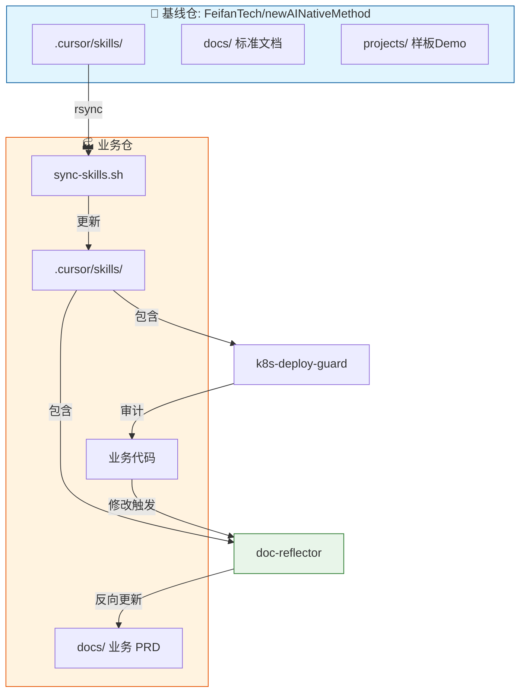

# AI-native 研发方法论仓库 · 总览

## 一、我们为什么要这个仓库？

### 背景

- **多团队、多系统、数据密集型业务**：传统研发流程很难把 AI 稳定嵌入到需求、设计、开发、评审各环节。
- **原则与技能分散**：架构原则、产品原则、开发规范若只存在于口头或零散文档，AI 与人都难以一致执行。
- **可复用模板缺失**：每个项目从零写 PRD、技术方案、评审清单，成本高且质量不稳定。

### 目标

用一套**可复制的原则、Skills 和流程**，把 AI 稳定嵌入日常研发：

- **原则**：架构、产品、开发各有一套原则与检查清单，供人与 AI 共同遵循。
- **Skills**：Agent Skills 格式的「技能包」（.cursor/skills），按角色与场景触发，产出规范格式的草稿与评审结论。支持 Cursor、Kiro、Claude Code 等主流 AI 工具。
- **模板与 Demo**：PRD、技术方案、工作量与风险分析等模板，以及按方法论落地的样板工程（projects/），供业务仓库拷贝或参考。

---

## 二、仓库结构说明

| 目录 | 说明 |
|------|------|
| **docs/architecture/** | 架构与数据密集型应用方法论、技术方案、ADR 等；含 **企业级检查清单**（可选，按技术栈：JAVA / PYTHON / TS，见对应 CHECKLIST.md）。 |
| **docs/product/** | PRD、产品文档、工作量与风险分析等。 |
| **docs/process/** | 研发流程、Code Review、AI 使用规范、Skills 指南、业务仓采纳指南等。 |
| **.cursor/skills/** | 与上述原则对应的 Skills 集合（Agent Skills 格式），供 Cursor 等工具匹配使用。含维护指南：[SKILLS_OWNERS.md](./process/SKILLS_OWNERS.md)、[SKILLS_CHANGELOG.md](./process/SKILLS_CHANGELOG.md)。 |
| **.kiro/skills/** | 同上，通过软链接或复制 .cursor/skills/ 使用（见下方 Kiro 设置）。 |
| **projects/** | 按方法论落地的 **Demo / 样板工程**，每个子目录一个样板项目。 |
| **CURSOR.md** | 本仓与 AI 工具的约定：定位、允许/不允许 AI 做的事、结构速览，含 Kiro 设置说明。 |

---

## 三、如何在新项目中落地这套方法

1. **一键初始化（推荐）**：运行 `./scripts/init-repo.sh` 自动创建目录结构、同步 Skills、创建 Kiro 软链接、初始化 memory 目录。
2. **复制或定制约定文件**：从本仓拷贝 `CURSOR.md` 到业务仓库根目录，按业务调整「允许/不允许」与结构说明。
3. **选择并复制 Skills 子集**：从 `.cursor/skills/` 中挑选需要的技能（如 core、product、architecture 中的部分），拷贝到业务仓的 `.cursor/skills/`；业务专属技能可自行新增。
   - **Kiro 用户**：通过软链接 `ln -s .cursor/skills .kiro/skills` 或直接复制使用。
4. **套用文档模板**：使用 `docs/product/` 下的 PRD 模板、`docs/architecture/` 下的技术方案结构，在业务仓的 docs 中生成 PRD、技术方案、工作量与风险等。
5. **（可选）配置自动化**：参考 `docs/process/github-actions-example.md` 在业务仓配置 PR 审查等 CI；本仓为 Skills 与原则的「单一真相源」，业务仓可定期同步（拷贝 / submodule / subtree）。

更细的步骤见 **docs/process/adopt-this-project-in-your-repo.md**。

- **快速上手**：阅读 **docs/process/QUICK_START.md** 获取一页纸快速指南。
- **多人协作**：阅读 **docs/process/multi-person-collaboration.md** 了解大型项目的协作模式。

- **企业级检查清单（可选）**：若项目为 **Java/Spring**、**Python/FastAPI 或 Django**、**TypeScript/Node/Nest**，架构与编码类 Skill 会结合 **docs/architecture/** 下对应 CHECKLIST（JAVA / PYTHON / TS）逐项审查并给出结论；其他技术栈可跳过。

---

## 四、千岛湖溯源 Demo 作为示例

- **位置**：`projects/qiandao-lake-traceability-demo/`
- **用到的原则与文档**：产品设计原则（PRD）、技术架构原则（技术方案）、工作量与风险分析。
- **对应文档**：
  - 产品：`docs/product/QIANDAO_LAKE_FISHERY_TRACEABILITY_PRD.md`
  - 架构：`docs/architecture/QIANDAO_LAKE_TRACEABILITY_TECH_SOLUTION.md`
  - 工作量与风险：`docs/product/QIANDAO_LAKE_TRACEABILITY_EFFORT_AND_RISKS.md`
- **示范路径**：PRD → 技术方案 → 工作量与风险 → Demo 实现；各阶段可由 Cursor 结合对应 Skills 生成草稿，人工审阅后采纳。

### 标杆案例详解

详细的项目过程记录见 **docs/case-studies/qiandao-lake-traceability/**：

| 文档 | 内容 |
|------|------|
| [README.md](../case-studies/qiandao-lake-traceability/README.md) | 案例索引与结构 |
| [1_overview.md](../case-studies/qiandao-lake-traceability/1_overview.md) | 项目概述 |
| [2_requirements/](../case-studies/qiandao-lake-traceability/2_requirements/) | 需求阶段：原始需求→AI PRD草稿→审核→定稿 |
| [3_architecture/](../case-studies/qiandao-lake-traceability/3_architecture/) | 架构阶段：设计需求→AI方案草稿→审核→定稿 |
| [4_implementation/](../case-studies/qiandao-lake-traceability/4_implementation/) | 实施阶段：任务拆解→代码生成→踩坑记录 |
| [5_review/](../case-studies/qiandao-lake-traceability/5_review/) | 复盘总结 |

这个案例展示了完整的 AI-native 工作流程，包括 Human Gate 决策、经验沉淀等最佳实践。

---

## 五、基线仓与业务仓协同全景

下图说明基线仓（本仓）与业务仓如何通过 Skills 同步、文档反向同步与部署守卫协同运作。

---

## 六、立即执行清单 (Action Plan)

团队可按以下清单在业务仓或本仓中落地/维护这套机制：

| 步骤 | 内容 | 说明 |
|------|------|------|
| **1** | 创建并维护同步脚本 | 本仓已提供 `scripts/sync-skills.sh`；业务仓复制到 `scripts/` 后执行即可从基线仓拉取最新 `.cursor/skills`。可选：加入 CI 或 postinstall。 |
| **2** | 创建/同步技能 | 本仓已包含 `doc-reflector`（代码变更→文档反向更新）、`k8s-deploy-guard`（K8s/部署配置守卫）。业务仓通过 sync-skills.sh 或手动拷贝即可获得。 |
| **3** | （可选）泛化与参考 | 若有溯源/存证类新项目，可参考 `docs/product/`、`docs/architecture/` 下千岛湖相关文档与 `projects/qiandao-lake-traceability-demo` 作为 Reference；无需在本仓新增泛化 Skill 时跳过。 |
| **4** | 更新文档与清单 | 在 README 或本总览中引用「五、基线仓与业务仓协同全景」的 Mermaid 图，说明分发、防漂移、Ops 守卫的运行逻辑；本清单便于团队按步骤执行。 |

---

**文档版本**：v0.1  
**维护**：随本仓结构或流程变更更新本总览。
