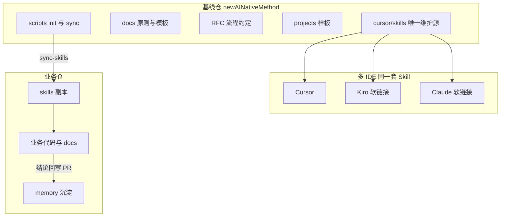
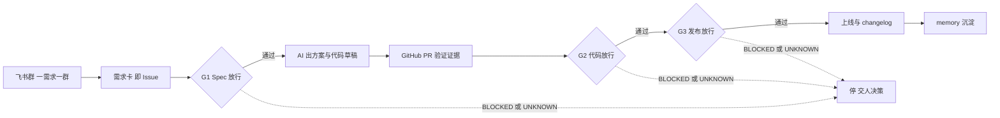
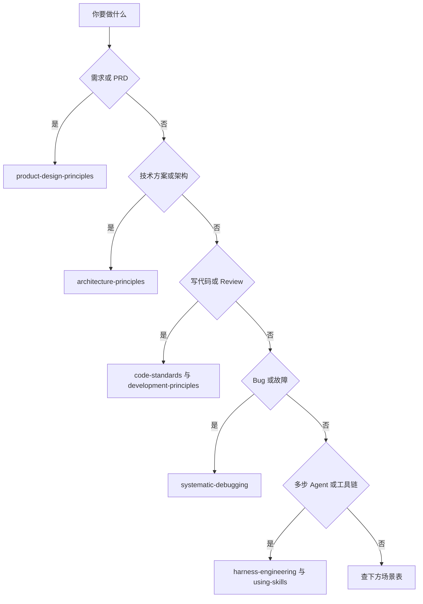
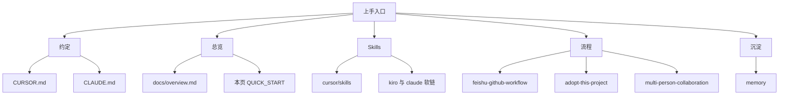

# AI-native 研发快速上手指南

> 一页纸 + 图：先看图建立心智模型，再查表找 Skill。  
> 与 [approach.md](../../RFC/ai_native_org/approach.md)、[CURSOR.md](../../CURSOR.md) 约定一致。

---

## 核心原则

**AI 是执行与推演的加速器，人是决策者。**

- AI：生成草稿、执行任务、给建议
- 人：审核、决策、确认 Human Gate
- AI 响应前按 [using-skills](../../.cursor/skills/using-skills/SKILL.md) 加载对应 Skill

---

## 1. 30 秒看懂本仓

本仓是**方法论 + Skills 基线仓**，不是业务线上代码仓。业务仓用脚本同步 Skills，不直接在业务里改基线。



| 你要找… | 去哪 |
|---------|------|
| 原则与模板 | `docs/architecture/` · `docs/product/` · `docs/process/` |
| Agent Skills | `.cursor/skills/`（Kiro/Claude 走软链接） |
| 流程约定 / RFC | `RFC/`、本页下方工作流图 |
| 样板怎么做 | `projects/` + `docs/case-studies/` |
| 团队沉淀 | 业务仓 `memory/`（经 PR 回写） |

---

## 2. 一条需求怎么走（飞书 + GitHub）

小需求（≤5 人日）群内闭环；大需求或命中例外（数据/权限/资金/生产配置）→ 群评审 + IDE 分步实现。硬规则：**群里定稿必须回写 Git**。



三个真人门 ↔ 本仓机制：G1 ≈ Mob Elaboration，G2 ≈ Mob Construction，G3 ≈ 发布 Human Gate。  
详文：[feishu-github-workflow.md](./feishu-github-workflow.md) · [需求卡](./requirement-card-template.md) · [度量](./ai-native-metrics.md)

**三态门控（Harness）**：`PASS` / `BLOCKED` / `UNKNOWN` —— **UNKNOWN ≠ 通过**。见 Skill `harness-engineering`。

---

## 3. 场景 → Skill（先选对工具）



| 场景 | Skill | 深度 |
|------|-------|------|
| 写/评审 PRD | `product-design-principles` | 完整 |
| 写技术方案 | `architecture-principles` | 完整 |
| 写代码 / Code Review | `code-standards` + `development-principles` | 完整 |
| 调试 Bug | `systematic-debugging` | 四阶段 |
| 部署 K8s | `k8s-deploy-guard` | 清单 |
| 更新文档 | `doc-reflector` | 代码→文档 |
| Release Notes | `release-notes-from-commits` | 自动草稿 |
| 决策汇总 | `decisions-summary` | 自动汇总 |
| 多步 Agent / 生产可靠性 | `harness-engineering`（叠加 `using-skills`） | 缰绳检查 |

### 轻量模式

| 场景 | 简化 |
|------|------|
| 简单 Bugfix | `systematic-debugging`，聚焦根因+修复 |
| 文档修改 | `doc-reflector` 或直接改 |
| 配置变更 | `k8s-deploy-guard` |
| 小需求（1–2 天） | PRD 只写背景、目标、功能 3 点 |

---

## 4. 红灯与 Human Gate

**触达即停，交人决策：**

1. 需求/方案未成文档就进实现  
2. 验收标准不可测  
3. 关键假设/决策未记录  
4. 未考虑边界与异常  
5. 未经 Code Review 合并到主分支  
6. 必检项缺失/无证据却宣称完成（按 UNKNOWN 处理）

**必须人确认：** 合并 main/master · 生产部署 · 改数据模型/核心接口 · 安全合规决策

---

## 5. 常用命令

```bash
# 业务仓首次：先把 scripts/init-repo.sh 从基线仓拷过去，再执行
./scripts/init-repo.sh

# 同步基线 Skills
./scripts/sync-skills.sh

ls -la .cursor/skills/
```

多 IDE 软链接、Skill 写作与分发：[skill-writing-and-distribution.md](./skill-writing-and-distribution.md)

---

## 6. 关键文件一览



| 文件 | 作用 |
|------|------|
| `CURSOR.md` | AI 工具约定（含 using-skills、Kiro/Claude） |
| `CLAUDE.md` | Claude Code 约定 |
| `docs/overview.md` | 方法论总览 + 基线↔业务协同图 |
| `.cursor/skills/` | 技能库（唯一维护源） |
| `memory/` | 决策/产品/工程/changelog（业务仓） |
| `.github/pull_request_template.md` | PR 验证证据 + 三态 |

---

## 相关文档

- [adopt-this-project-in-your-repo.md](./adopt-this-project-in-your-repo.md) — 业务仓落地
- [multi-person-collaboration.md](./multi-person-collaboration.md) — 多人协作与 Human Gate
- [skill-writing-and-distribution.md](./skill-writing-and-distribution.md) — Skill 写作与多 IDE 分发
- [feishu-github-workflow.md](./feishu-github-workflow.md) — 飞书 + GitHub 全流程
- [CURSOR_SKILLS_GUIDE.md](./CURSOR_SKILLS_GUIDE.md) — Skills 与 Rules 指南
- [docs/overview.md](../overview.md) — 基线仓与业务仓协同全景图

---

> 复杂场景请读完整 Skill：`.cursor/skills/*/SKILL.md`。图不够细时，以流程卡与 RFC 为准。
