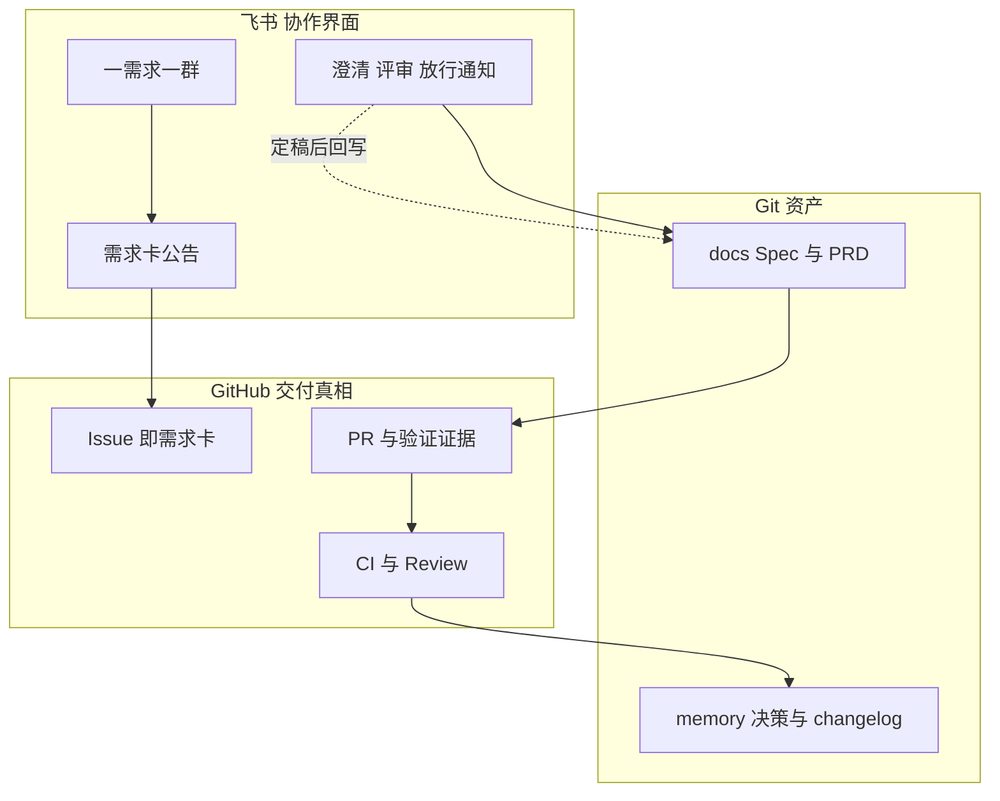

# 飞书 + GitHub 工作流（流程卡）

> 背景与取舍见 `RFC/feishu-github-flow/RFC-feishu-github-flow.md`。本文是可直接执行的一页流程。  
> 总览图见 [QUICK_START.md](./QUICK_START.md) §2。

## 1. 建群与立项

1. 每个需求建一个飞书群，群名：`[需求] 简称 #IssueNo`。
2. 先在 GitHub 建 Issue，按 [requirement-card-template.md](./requirement-card-template.md) 填需求卡；同一张卡贴到群公告。
3. 群里只讨论这一个需求；Issue 编号是两边唯一对账键。

## 2. 复杂度分流

| 类型 | 判定 | 做法 |
|------|------|------|
| 小需求 | 预估 ≤5 人日，单模块，无数据/权限/资金变更 | 群内澄清 → AI 出方案与实现 → 人确认 → PR |
| 大需求 | >5 人日，或跨模块/跨团队，或涉及数据、权限、资金、对外接口 | 群内评审 Spec → Plan（Level 1）→ IDE 中分步实现 → PR |

例外：即使 ≤5 人日，凡涉及数据迁移、权限、资金、生产配置，一律按大需求处理。拿不准时按大需求。

## 3. 三个真人门

| 门 | 位置 | 对应机制 | 通过条件 | 证据 |
|----|------|----------|----------|------|
| G1 Spec 放行 | 飞书群 | Mob Elaboration | 验收标准可测试；范围/不做项明确；负责人在群里明确确认 | Spec/PRD 已 PR 入库（`docs/`），群里贴链接 |
| G2 代码放行 | GitHub PR | Mob Construction + Harness | CI 全 PASS；PR 验证证据完整；至少一名真人 Review | PR 评审记录 |
| G3 发布放行 | 飞书群 | 发布 Human Gate | 发布 checklist、回滚方案、观测项齐备；按风险由指定负责人确认 | 群内确认 + changelog |

任一门出现 BLOCKED 或 UNKNOWN：停，交人决策（见 `harness-engineering` 三态门控）。

## 4. 哪些必须在 Git，哪些可只在飞书

必须在 Git：Spec/PRD、方案与决策（`memory/decisions.md`）、代码、验证证据、变更记录。
可只在飞书：澄清过程、临时讨论、通知提醒。
结论性内容（范围变更、验收标准调整、风险接受）必须在 24 小时内通过 PR 或 Issue 评论回写。

## 5. 收尾与沉淀

1. 发布后在 Issue 写复盘三行：做对了什么、返工点、可沉淀规则。
2. 可复用规则/踩坑，经 PR 回写 `memory/` 或对应 Skill。
3. 按 [ai-native-metrics.md](./ai-native-metrics.md) 记录四项指标。
